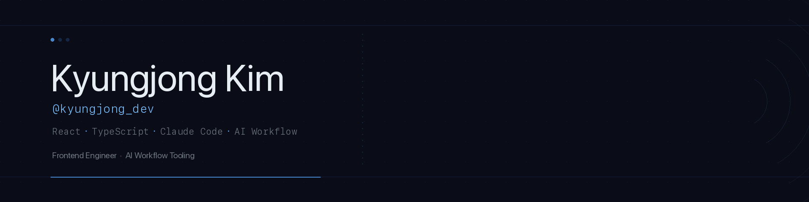

 

FE Engineer focused on production-grade web UIs with React & TypeScript.
Lately, building tools that let AI handle the repetitive parts of dev work.

---

---

**Done**

- **ui-kit** — personal design system, 22 primitives (Radix + CVA + Tailwind)

**In Progress**

- **claude-code-harness** — operational rules from running Claude Code daily for 6+ months. Going public late May.
- **design-harness** — claude-code-harness adapted for library / design system projects
- **arch-doc-gen** — codebase or spec → Mermaid + Markdown architecture docs (Claude API)

---

[velog.io/@kyungjong_dev](https://velog.io/@kyungjong_dev)
